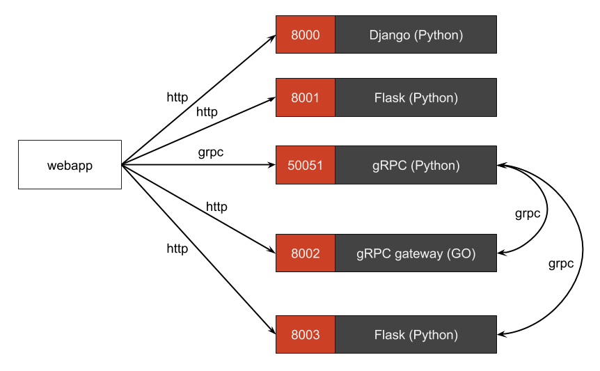

# pycones18-grpc-vs-httpjson
PyConES2018 - Comparing gRPC+Protobuf vs JSON+HTTP in Python

## gRPC+Protobuf or JSON+HTTP?
This repository contains 5 equal APIs: gRPC using Protobuf and JSON over HTTP. The goal is to run benchmarks for all approaches and compare them. The backend is powered by 5 microservices, 4 of which happen to be written in Python and the grpc-gateway proxy is written in Go.

### Services organization

The application consists of the following application services:

| Service      | Port  | Protocol | Description                                                   | Language service |
|--------------|-------|----------|---------------------------------------------------------------|------------------|
| django       | 8000  | http     |Provides a django webapp                                       | Python           |
| flask        | 8001  | http     |Provides a flask webapp                                        | Python           |
| grpc         | 50051 | grpc     |Provides a grpc webapp                                         | Python           |
| grpc-gateway | 8002  | http     |Provides a grpc proxy                                          | Golang           |
| grpc-rest    | 8003  | http     |Provides a flask webapp which grpc client is called by request | Python           |

### Requirements

 - Install [Docker](https://www.docker.com/get-docker)
 - Install [Docker Compose](https://docs.docker.com/compose/install)

### Run

```
docker-compose build
docker-compose up
```

### Test http json services

#### django service
```
$ curl -i http://localhost:8000/v0/api/
```
#### flask service
```
$ curl -i http://localhost:8001/v0/api
```
#### grpc gateway service
```
$ curl -i http://localhost:8002/v0/api
```
#### grpc rest service
```
$ curl -i http://localhost:8003/v0/api
```
